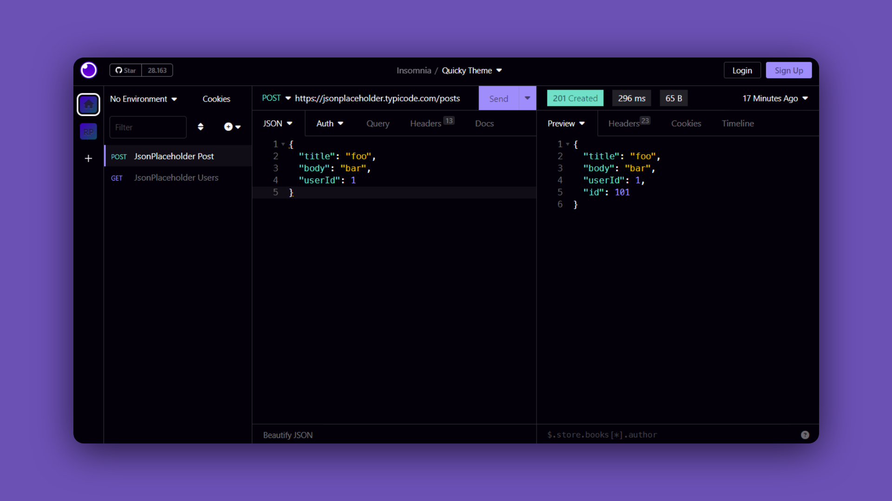

<h3 align="center">
	<br/>
	Quicky Theme for Insomnia
</h3>



## Usage

#### Manual

```bash
git clone https://github.com/RenerPires/quicky-insomnia-theme
cp -r quicky-insomnia-theme ~/.config/Insomnia/plugins/insomnia-plugin-theme-quicky
```

### Apply

1. Open Insomnia
2. Navigate to **`Preferences > Themes`** and you should see **Quicky** theme available.

&nbsp;

<p align="center">
Copyright &copy; 2023-present
</p>